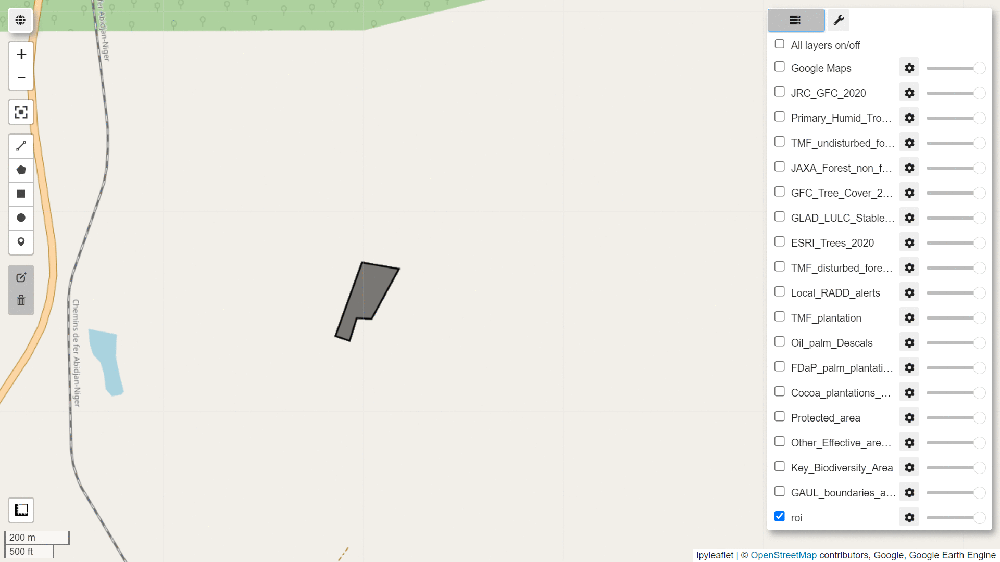

whisp
=====
[](https://github.com/openforis/sepal/blob/master/license.txt)

***whisp*** stands for **WH**at **IS** in that **P**lot ?

The Forest Data Partnership promotes a Convergence of Evidence approach for Forest and Commodities Monitoring

- no single source of geospatial data (i.e a land cover map) can tell the whole story around any given plot of land,
- all the existing, published and available datasets contribute to telling that story

***whisp***  implements that convergence approach by providing a transparent and public processing flow using those datasets

--------------------------------------------------------------------------------



# Requirements

- A Sepal account.
- A Google Earth Engine (GEE) account.
- A registered cloud GEE project.
- Some experience in Python or a similar language.

# Setup

Clone the Whisp repo and install the package:
```
git clone https://github.com/forestdatapartnership/whisp.git
cd whisp/
pip install .
```

Create a `.env` file with the required information for Earth Engine login (you may copy and edit the `.env.template` file)


# Contributing

Install the package in editable mode with the additional dependencies required for testing and running pre-commit hooks:
```
git clone https://github.com/forestdatapartnership/whisp.git
cd whisp/
pip install .[dev]
```

Setup the pre-commit hooks:
```
pre-commit install
```


You should be able to run the Pytest suite by simple running the `pytest` command from the repo's root folder.

Please read the  for good practice recommendations.


# whisp pathways
***whisp*** can be implemented through at least three pathways

1. As an operationnal API in JS and Python

2. Through mobile applications to enable smallholder in the field directly generate and own the monitoring data associated with their plots of land

3. Integrated through Graphical User Interfaces for demonstration and verification purposes

4. Python Notebook implementation.

More info on Whisp can be found in [here](https://unfao-my.sharepoint.com/:b:/g/personal/maria_valbuenaperez_fao_org/EZAaBgWDruZOgL39BUp3AzgBORN6X1ttWIRgO6jg0mwOfQ?e=MWfVcb)

## How to Whisp Your Data Using the Python Notebook Pathway

The Python notebooks are currently set up to run in Sepal and to focus on polygon data provided by the user or geo_ids that allow the notebooks to access polygons stored and registered in the Asset Registry. NB: We value your feedback in terms of what input data we should support.

If your data is available as a feature collection and the GitHub repo is cloned, you are ready to start processing. We suggest first familiarizing yourself with running the notebooks using the default inputs in the notebook code. This will allow you to understand the expected outputs and the general functionality, as well as check if the setup worked successfully.

### Whisping a Feature Collection

1. Open Jupyter Lab (see Apps).
2. Open the notebook `whisp_feature_collection.ipynb` from inside your Whisp folder. If you wish to view the original in GitHub, see [here](https://github.com/forestdatapartnership/whisp/blob/main/whisp_feature_collection.ipynb).
3. To run the notebook cells, press the Play icon, or use the Shift + Enter shortcut. For more info on Jupyter and controlling notebooks, see [here](https://jupyter.org/try-jupyter/lab/).
4. You can change the ROI (region of interest) to point to your own feature collection data instead of the default input feature collection asset.
5. The outputs from the notebook will appear in your output folder (outside the Whisp repository folder).
6. Outputs from the process include a CSV file `whisp_output_table.csv`.
7. NB If the processing job is large (currently defined as such if it has over 500 features), the Whisp output may be sent to your Google drive, or stored as GEE assets. We are developing functionality to upload

### Adding Geo IDs to your results (Optional)
1. After the main Whisp process, there are some optional steps for adding geo_ids to each of the features in your feature collection. This uses functionality from the Asset Registry API (see https://asset-registry.agstack.org/ for details).
2. Currently, the process of registering a plot takes about 2-3 seconds. The speed of this external API should increase in the future. In the meantime, we use the approach of creating a lookup table (a temporary CSV called `temp_geo_id_lookup.csv`) containing geo-ids for each feature.  This can then be joined to the CSV output of Whisp (i.e., `whisp_output_table.csv`) via a common id (currently the `system:index` as this is a property present in every GEE feature collection). The notebook is set up to create a new version of the results with the Geo ID column appended : `whisp_output_table_w_geo_ids.csv`, but the output name is easily changed e.g. to overwrite the original output table if preferred.
3.  This file stores geo_ids along with a unique id (`system:index`) from the feature collection. This system:index column can then be used to join the Geo IDs column on to the Whisp output table (`whisp_output_table.csv`). Similarly the lookup can also be used to join Geo IDs to the input feature collection.
4. This approach is useful when registering large numbers of features/plots, as if the process is interrupted (e.g., if a bug occurs or the SEPAL instance times out), the lookup CSV still contains all the geo ids processed until this point. Therefore, the process automatically continues from where it stopped when this cell is rerun.
5. This lookup table of Geo IDs is then appended to the results from Whisp.

### Adding risk indicators to your results
7. Finally, functions at the end of the notebook allow the user to add EUDR risk indicators to the table. NB: these risk indicators are still at the experimental stage.

### Intermediate Output

- A temporary CSV called `temp_geo_id_lookup.csv` contains a geo id column and a `system:index` column.

### Output 1

- A CSV called `whisp_output_table.csv` contains results from the whisp processing.

### Output 2

- A CSV called `whisp_output_table_w_geo_ids.csv` contains results from the whisp processing along with a column for the newly registered geo ids.

### Output 3

- A CSV called `whisp_output_table_w_geo_ids_w_risk.csv` contains results from the whisp processing, the registered geo ids, and EUDR risk indicators.

## Whisping a List of Geo IDs

1. Open Jupyter Lab (see Apps).
2. Open the following notebook from your files `whisp_geo_id.ipynb`. If you wish to view the original on GitHub, see [here](link_to_github).
3. NB: This notebook assumes you have registered some plots already in the AgStack Asset Registry and have obtained the corresponding Geo IDs.
4. Run the cells as with the previous notebook.
5. This notebook requires a list of Geo IDs.
6. Each Geo ID corresponds to a unique boundary in the Asset Registry. The functions in this notebook fetch the boundaries and turn each Geo ID into a feature stored in a feature collection.
7. The feature collection is then run in the same way as with the previous notebook, producing Whisp summary statistics as a series of CSV tables.

## Other Files

### Parameters Folder

A folder containing a series of Python scripts and a CSV. These files are used to define various parameters used in the analysis.

Key files include:
- `lookup_gee_datasets.csv` contains the list of input datasets, the order they will be displayed, which ones are to be excluded from the current analysis, and which ones are shown as flags (i.e., shown as presence or absence instead of figures for area/percentage coverage of the plot).
- `config_runtime.py` contains parameters that the user can tweak, e.g., file and column names. **WARNING: USERS SHOULD NOT EDIT PACKAGE CONFIG ; IF THEY WANT TO, THEY SHOULD INSTALL THE PACKAGE IN EDITABLE MODE IN ORDER TO BE ABLE TO MODIFY CONFIGS WITHOUT HAVING TO RE-INSTALL THE PACKGE EVERY TIME**

### src code

Various functions for the main Whisp analysis along with some for interacting with the AgStack Asset Registry.

Key files:
- `datasets.py` contains a series of functions related to the creation of a single multiband GEE image to be used in the Whisp summary statistics analysis.
- `stats.py` contains functions to run the Whisp analysis for each of the various datasets and to provide results for coverage of each plot as a percentage (or as an area in hectares).

## Setting Up Your System


### Setting Up SEPAL

SEPAL is closely linked to Google Earth Engine (GEE), a Google-powered Earth-observation cloud-computing platform, as it builds in many of its functionalities. Currently, you will need to have connected SEPAL and GEE accounts. SEPAL provides a stable processing environment and allows you to link up with your Google account saving time with permissions. Currently, we are supporting the use within SEPAL, but you can run the scripts outside of SEPAL if required, although this will require extra code to account for the various dependencies SEPAL already has built in.

1. Login to SEPAL.
2. Start an instance (see Terminal info) to provide you with free processing power.
3. If you don’t have SEPAL set up:
    - To create a SEPAL account, please follow the registration steps described [here](link_to_sepal_registration) and then familiarize yourself with the tool by exploring its interface.
    - To create a Google Earth Engine (GEE) account, please follow these steps and don’t forget to initialize the home folder.

### Setting Up the Whisp GitHub Repository

1. Make sure you have a GitHub account set up.
2. To run the Whisp notebooks in SEPAL, you need to copy the Whisp repository into your SEPAL files. The notebooks rely on functions and parameters that are stored in other files in this repository.
3. To clone (i.e., copy) the GitHub repository so that it is accessible in SEPAL, type into the SEPAL terminal:

    ```sh
    git clone https://github.com/forestdatapartnership/whisp.git
    ```

4. If this works, on the left-hand pane you should now be able to view a Whisp folder containing Notebooks along with other supporting files and folders.

### Setting Up Your Input Data

#### Converting Plot Data into a Feature Collection

Whisp summary statistics are processed using the cloud computing platform Google Earth Engine (GEE). To do this, plot data needs to be in feature collection format.

#### Conversions via the GEE Python API: ‘On the Fly’ Processing with GeeMap

To help, Whisp notebooks support conversion on the fly from shapefiles. This is carried out using functions from the geemap package. The Geemap package also supports other vector dataset conversions, such as from a GeoJSON, KML, or WKT to a feature collection, etc. For details and code examples see [here](link_to_geemap_info).

#### Conversions via GEE Code Editor: Uploading Shapefile as a GEE Asset

However, as large or detailed polygon data may cause conversion errors, for more reliable functionality, you can also upload a shapefile straight into the GEE code editor where it is stored as a feature collection asset. This is documented [here](link_to_gee_code_editor_doc) as well as below.

1. Go to Assets in the top left panel in the Earth Engine Code Editor page.
2. Clicking on it will open the Asset Manager.
3. Select New.
4. You will have several choices. Choose Vector (Shapefiles).
5. A pop-up window will appear. Navigate to the location of your data.
6. In the pop-up window, select the file you want to upload from your computer.
7. You can upload the vector data in a compressed mode as a .zip file. If not, remember that a .shp file alone is not sufficient and must be accompanied by other files describing the vector data. Any file errors will be highlighted by the uploader.
8. Once all files are loaded correctly, they are displayed in the task manager.
9. Typically, this process takes a couple of minutes depending on the size of the dataset. The progress of the upload is displayed in the task manager.
10. The uploaded assets will be listed in the Assets List under the Assets tab. If not displayed, click on the Refresh button.
11. Clicking on the asset will open a pop-up window to allow you to explore the table.
12. The feature collection asset is ready to use. NB: You can visualize, share, or delete it as needed within the code editor interface.
