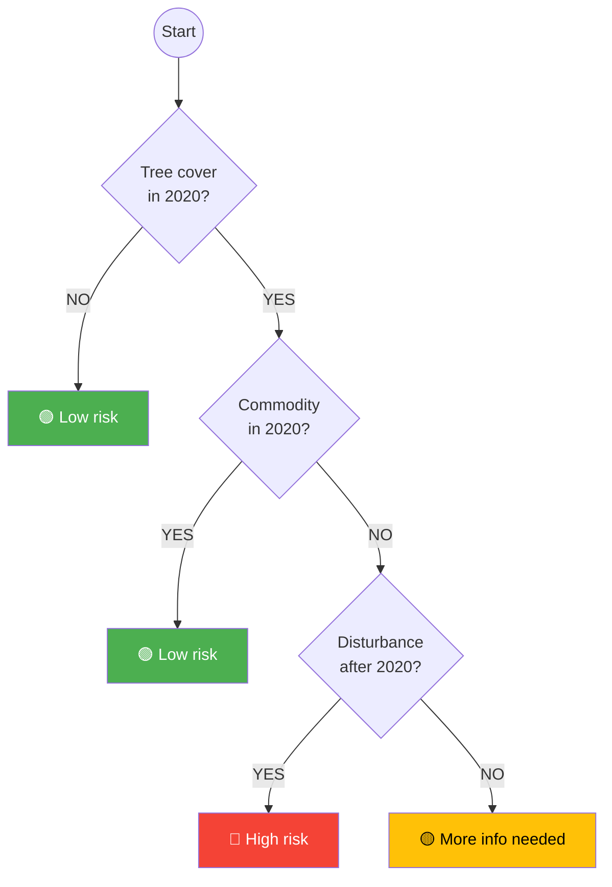

# Annual Crop Risk Decision Tree (soy)

This diagram represents the annual crop risk assessment logic as implemented in `add_risk_acrop_col()` in [src/openforis_whisp/risk.py](../src/openforis_whisp/risk.py).

## Indicator mapping

| Decision node | Indicator | Code variable |
|---|---|---|
| Tree cover in 2020? | Ind_01 | `ind_1_name` |
| Commodity in 2020? | Ind_02 | `ind_2_name` |
| Disturbance after 2020? | Ind_04 | `ind_4_name` |

## Difference from perennial crop (pcrop) risk

The annual crop decision tree does **not** use Ind_03 (disturbance before 2020). This means prior disturbance is not considered a mitigating factor for soy/annual crop risk, unlike for perennial crops.
