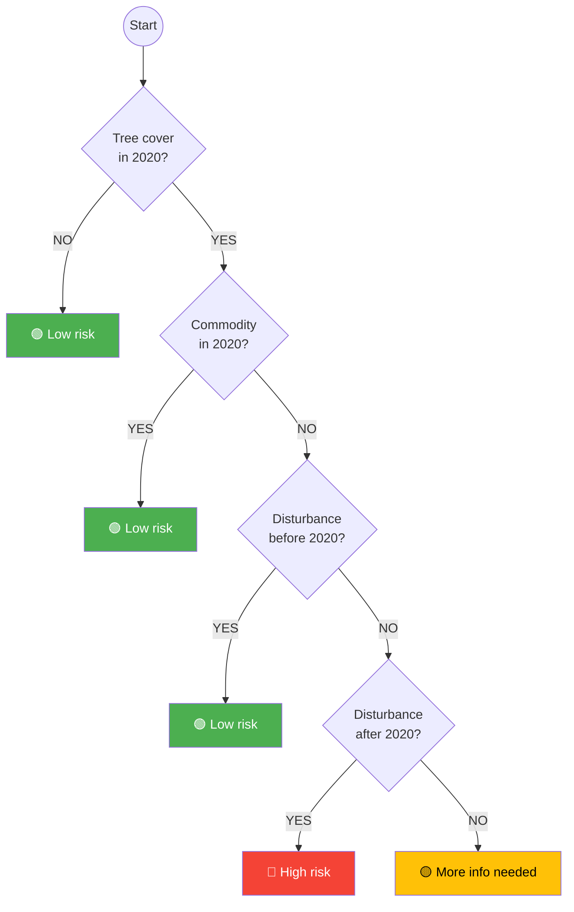

# Perennial Crop Risk Decision Tree (coffee, cocoa, rubber, palm oil)

This diagram represents the perennial crop risk assessment logic as implemented in `add_risk_pcrop_col()` in [src/openforis_whisp/risk.py](../src/openforis_whisp/risk.py).

## Indicator mapping

| Decision node | Indicator | Code variable |
|---|---|---|
| Tree cover in 2020? | Ind_01 | `ind_1_name` |
| Commodity in 2020? | Ind_02 | `ind_2_name` |
| Disturbance before 2020? | Ind_03 | `ind_3_name` |
| Disturbance after 2020? | Ind_04 | `ind_4_name` |

## Note

The code evaluates the first three conditions (`ind_1 == "no"`, `ind_2 == "yes"`, `ind_3 == "yes"`) as a single OR check — any one of them being true results in Low risk. The diagram shows them sequentially for clarity, but the order between them does not matter in practice.
