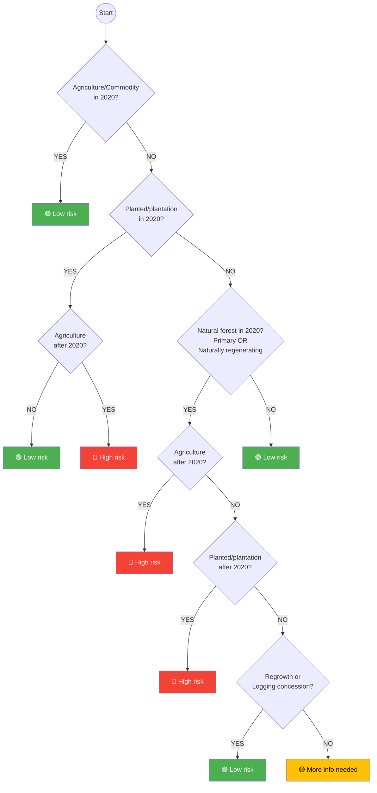

# Timber Risk Decision Tree

This diagram represents the timber risk assessment logic as implemented in `add_risk_timber_col()` in [src/openforis_whisp/risk.py](../src/openforis_whisp/risk.py).

## Indicator mapping

| Decision node | Indicator | Code variable |
|---|---|---|
| Agriculture/Commodity in 2020? | Ind_02 | `ind_2_name` |
| Planted/plantation in 2020? | Ind_07 | `ind_7_name` |
| Natural forest in 2020? (Primary) | Ind_05 | `ind_5_name` |
| Natural forest in 2020? (Naturally regenerating) | Ind_06 | `ind_6_name` |
| Agriculture after 2020? | Ind_10 | `ind_10_name` |
| Planted/plantation after 2020? | Ind_08 | `ind_8_name` |
| Regrowth (treecover after 2020)? | Ind_09 | `ind_9_name` |
| Logging concession? | Ind_11 | `ind_11_name` |
